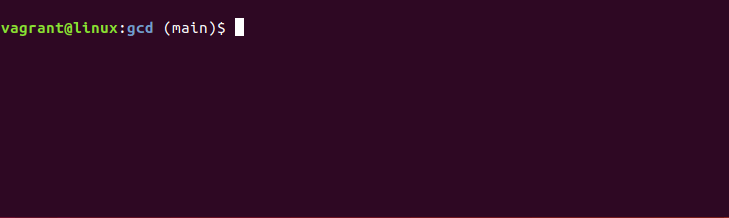

# Git's smart change directory (gcd)

It is a CLI tool that performs "change directories" in git repository space very short and smart.
If you have a unique directory name under the control of git, you can skip the layered PATH and move by just the directory name.

## About
- Git cannot add a completely empty directory. Many people who want to maintain an empty directory in Git have created a convention of putting a file called ".gitkeep" in that directory.

- The program uses the .gitkeep file to do the following :  
  - After adding the file to an empty DIR, use the ".gitkeep" file without deleting it.
  - It will create a list of PATH for the directory where the ".gitkeep" file is located.
  - It then compares that list with the name of the destination directory and changes it directly to the full path with a forward match.
  - Do a Change Directory using this.

## Example 
1. Suppose you have directories.  The Git repository is `/repo`.  
`/repo/sample/hier/route1/hierA/hierB/hierC` and `/repo/sample/hier/route2/levelA/levelB/LevelC`.
1. This is an example of moving to "hierC" first and then to "levelC".
- `cd` : (Standard change directory)
    ```bash
    $ pwd
    /repo
    $ cd sample/hier/route1/hierA/hierB/hierC    
    $ cd ../../../../route2/levelA/levelB/LevelC  
    ```  
      

- `gcd` : (git-smart change directory)
    ```bash
    $ pwd 
    /repo
    $ gcd hierC        #Unique DIR name.
    $ gcd L            #Unique directory header character.For example,Leve,Lev,or L may be used.
    ```
      
    - In this way, you can move smartly without entering your PATH.  

## Environment (develop)
1. Ubuntu 18.04.5 LTS
1. rustc 1.50.0 
1. git version 2.17.1


## Build 
- release 
    ```
    $ cargo build --release
    ./target/release/gcd
    ```
- compact release
    ```
    $ cargo rustc --release -- -C opt-level=z -C link-args=-Wl,-x,-S
    $ file ./target/release/gcd
    ./target/release/gcd: xxx,xxx, not stripped
    
    $ strip ./target/release/gcd
    $ file ./target/release/gcd
    ./target/release/gcd: xxx,xxx, stripped
    ```

## Setting bash
1. Must be set to alias. Add to `$HOME/.bashrc`
    ```bash
    function _gcd() {
        gd=`~/<USER Build PATH>/target/release/gcd $1`;
        cd $gd;
        pwd;
    }
    alias gcd=_gcd
    ```
1. (Optional: Application to bash-completion.) Add to `$HOME/.bash_completion` 
    ```bash
    function comp_gcd() {
      COMPREPLY=( $(compgen -W "$( git rev-parse --show-toplevel | xargs -I {} cat "{}/.keepCache" | awk -F/ \{print\ \$\(NF-1\)\} | tr "\n" " ")" ${COMP_WORDS[COMP_CWORD]}  ) ) 
    }
    complete -F comp_gcd gcd
    ```


## Setting csh  
1. Must be set to alias. Add to `$HOME/.cshrc`
    ```bash
    alias gcd 'cd `(~/<USER Build PATH>/target/release/gcd \!*)`;pwd'
    ```
1. (Optional: Application to completion.) Add to `$HOME/.cshrc` 
    ```bash
    complete gcd 'p@1@`git rev-parse --show-toplevel | xargs -I {} cat "{}/.keepCache" | awk -F/ \{print\ \$\(NF-1\)\} | tr "\n" " "`@'
    ```

## Setting common (bash & csh)
1. (Optional: Symbolic links can be used by creating a Config file.) Create a `<git root directory>/.keepSlink` file. 
    Example: The sample symbolic directory is described as follows.
    ```bash
    $ cat .keepSlink  
    ./sample/hier/route2/levelA/s_hierB/  
    ./sample/hier/route2/levelA/levelB/s_hierC/  
    ```
    - This is useful for non-Git managed DIRs.
    
## Other operations
1. Rebuild the dictionary `.keepCache` 
    ```bash
    $ gcd //        #Create a list and go to the repository root.
    ```
1. Create `.gitkeep` to target the current DIR.
    ```bash
    $ gcd ..        #Place ".gitkeep" in the current DIR and rebuild the dictionary.
    ```
1. Go to the root DIR in your Git repository. (Git Home Directory)
    ```bash
    $ gcd
    ```
1. Internal Automatic Operation
    1. If the creation date of the file ".git/logs/HEAD" is newer than the creation date of the dictionary list, the dictionary list ".keepCache" will be automatically rebuilt before being moved by the command. 

## Status
- Release v0.1.0 : I started using commands in normal work.
- Start v0.0.0 : I was thinking of learning a non-interpreter language and considered C and Rust. I thought the Rust language would be interesting to start with; I often work in Git's Shell environment and wanted to make it easy to move DIRs that require up and down the hierarchy, so that's what I went for for my first Rust. I just want to make it look like Rust, as the compile error has just disappeared.

